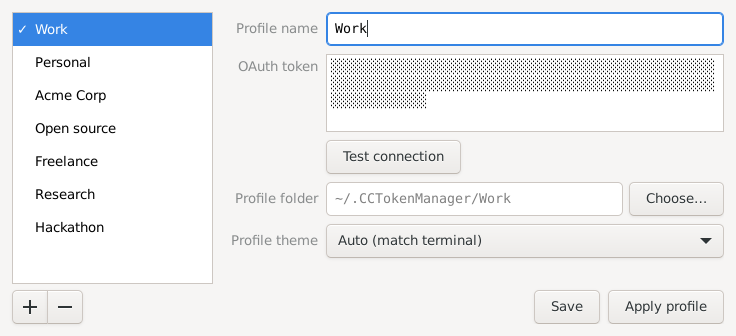

<p align="center">
  
</p>

<h1 align="center">CC Token Manager</h1>

<p align="center">
  <b>Create and switch profiles for Claude Code.</b><br>
  A small tray app for macOS, Windows and Linux.
</p>

<p align="center">
  
  
  
</p>

<p align="center">
  <a href="https://github.com/nikiforov-org/CCTokenManager/releases/latest"><b>Download the latest release</b></a>
</p>

<p align="center">
  
</p>

Work account, personal account, a client's team plan — Claude Code only knows
one at a time. CC Token Manager keeps all your Claude accounts, Pro, Max or
Team, and switches Claude Code between them in a click. No logging out and back
in, no environment variables, no shell scripts.

## Features

- **One click to switch.** Pick a profile, press **Apply profile**, and every
  new `claude`, in every terminal, runs on it.
- **Each profile is its own world.** Its own history, settings, memory, MCP
  servers and theme. Nothing leaks from one subscription into another.
- **Your tokens stay secret.** They live in the macOS Keychain, Windows
  Credential Manager or the Linux keyring — never in a plain-text file.
- **Nothing to undo.** Quit the app and Claude Code is exactly as it was before.
- **Check before you switch.** **Test connection** makes sure a token works.
- **Stays out of the way.** Lives in the menu bar or tray and starts with your
  computer.

## Download

| System | File |
| --- | --- |
| macOS 11 or later | `CCTokenManager-<version>.dmg` |
| Windows 10 or 11 on x64, Windows 11 on Arm | `CCTokenManager-<version>-setup.exe` |
| Linux on x64 | `CCTokenManager-<version>-linux-x64-setup` |
| Linux on arm64 | `CCTokenManager-<version>-linux-arm64-setup` |

All of them are on the [releases page](https://github.com/nikiforov-org/CCTokenManager/releases/latest).

## Installation

### macOS

Open the `.dmg` and drag **CC Token Manager** to Applications. The app is not
notarized, so the first time macOS may refuse to open it: allow it in
**System Settings → Privacy & Security → Open Anyway**. After an update, the
Keychain asks once whether the app may read your tokens.

### Windows

Run the installer. It installs for your user alone, with no administrator
rights, and adds CC Token Manager to the Start menu. The installer is not signed,
so SmartScreen may stop it: choose **More info → Run anyway**.

### Linux

Run the installer for your processor. A browser does not keep a download
executable, so first:

```sh
chmod +x CCTokenManager-*-linux-*-setup
./CCTokenManager-*-linux-*-setup
```

It installs for your user alone, with no `sudo`, into
`~/.local/share/CCTokenManager`, and adds CC Token Manager to the menu of
applications.

## Getting started

1. **Get a token** for each subscription: run `claude setup-token` while signed
   in to it.
2. **Open the app** from its icon in the menu bar or tray (**Settings…** on
   macOS).
3. **Add a profile.** Press **+**, give the profile a name and paste its token.
   **Save** keeps it for next time.
4. **Apply it.** Press **Apply profile** and start a new Claude Code session.

## Requirements

- [Claude Code](https://claude.com/claude-code); on Windows version 2.1.281 or
  later
- A Claude subscription for each profile
- On Linux: glibc 2.35 or later (Ubuntu 22.04, Debian 12, Fedora 36 and newer),
  GTK 3 and a keyring (GNOME Keyring or KWallet)

## Good to know

- A newly applied profile reaches Claude Code sessions started after it;
  sessions already running keep going.
- `ANTHROPIC_API_KEY`, `ANTHROPIC_AUTH_TOKEN` or `CLAUDE_CODE_OAUTH_TOKEN`
  exported in your shell take priority over the applied profile.
- On Linux the icon shows in trays that support StatusNotifierItem: KDE Plasma,
  Xfce, Cinnamon, and GNOME with the AppIndicator extension, which Ubuntu
  includes. Where there is no tray, the window opens at launch instead.

## Uninstalling

- **macOS:** quit the app from its menu and move it to the Trash.
- **Windows:** **Settings → Apps → CC Token Manager → Uninstall**.
- **Linux:** **Uninstall** in the app's entry in the menu of applications, or
  `~/.local/share/CCTokenManager/uninstall --uninstall`.

On Windows and Linux the uninstaller asks whether to delete your saved profiles
and their tokens as well. On macOS they stay: the profiles in
`~/.CCTokenManager`, their tokens in the Keychain under **CC Token Manager**.

## Building from source

```sh
./builder/build.sh
```

Needs Go, the Xcode Command Line Tools for the macOS installer, which builds on
macOS alone, and Docker for the Linux ones. The installers land in `dist`.
