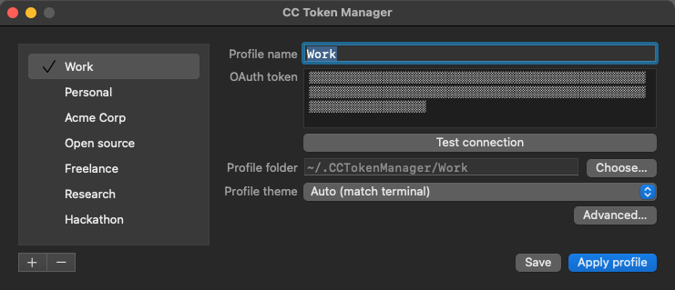

<p align="center">
  
</p>

<h1 align="center">CC Token Manager</h1>

<p align="center">
  <b>Create and switch profiles for Claude Code.</b><br>
  A small tray app for macOS, Windows and Linux.
</p>

<p align="center">
  
  
  
</p>

<p align="center">
  <a href="https://github.com/nikiforov-org/CCTokenManager/releases/latest"><b>Download the latest release</b></a>
</p>

<p align="center">
  
</p>

Work account, personal account, a client's team plan — Claude Code only knows
one at a time. CC Token Manager keeps all your Claude accounts, Pro, Max or
Team, and switches Claude Code between them in a click. No logging out and back
in, no environment variables, no shell scripts.

## Features

- **One click to switch.** Pick a profile, press **Apply profile**, and every
  new `claude`, in every terminal, runs on it.
- **Each profile is its own world.** Its own history, settings, memory, MCP
  servers and theme. Nothing leaks from one subscription into another.
- **Your tokens stay secret.** They live in the macOS Keychain, Windows
  Credential Manager or the Linux keyring — never in a plain-text file.
- **Nothing to undo.** Quit the app and Claude Code is exactly as it was before.
- **Check before you switch.** **Test connection** makes sure a token works.
- **Stays out of the way.** Lives in the menu bar or tray and starts with your
  computer.

## Download

| System | File |
| --- | --- |
| macOS 11 or later | `CCTokenManager-<version>.dmg` |
| Windows 10 or 11 on x64, Windows 11 on Arm | `CCTokenManager-<version>-setup.exe` |
| Linux on x64 | `CCTokenManager-<version>-linux-x64-setup` |
| Linux on arm64 | `CCTokenManager-<version>-linux-arm64-setup` |

All of them are on the [releases page](https://github.com/nikiforov-org/CCTokenManager/releases/latest).

## Installation

### macOS

Open the `.dmg` and drag **CC Token Manager** to Applications. The app is not
notarized, so the first time macOS may refuse to open it: allow it in
**System Settings → Privacy & Security → Open Anyway**. After an update, the
Keychain asks once whether the app may read your tokens.

### Windows

Run the installer. It installs for your user alone, with no administrator
rights, and adds CC Token Manager to the Start menu. The installer is not signed,
so SmartScreen may stop it: choose **More info → Run anyway**.

### Linux

Run the installer for your processor. A browser does not keep a download
executable, so first:

```sh
chmod +x CCTokenManager-*-linux-*-setup
./CCTokenManager-*-linux-*-setup
```

It installs for your user alone, with no `sudo`, into
`~/.local/share/CCTokenManager`, and adds CC Token Manager to the menu of
applications.

## Getting started

1. **Get a token** for each subscription: run `claude setup-token` while signed
   in to it.
2. **Open the app** from its icon in the menu bar or tray (**Settings…** on
   macOS).
3. **Add a profile.** Press **+**, give the profile a name and paste its token.
   **Save** keeps it for next time.
4. **Apply it.** Press **Apply profile** and start a new Claude Code session.

## Advanced…

**Advanced…** opens the flags of the profile on screen: every on/off setting
and variable Claude Code documents, and the tools a profile can deny, each with
a box ticked for on. Most start as Claude Code has them. Those below start the
other way, whatever Claude Code's own default: telemetry off, nothing going to
claude.ai or telling what your sessions are about, and Claude's name out of git.

While a profile is applied, its flags are in its `settings.json`: settings as
they are, variables in the `env` block, denied tools in `permissions.deny`.
Quitting the app takes them out again. A box you turn is that profile's alone:
**Apply profile** uses it at once, **Save** keeps it.

| For | Flag | Set to | What it turns off |
| --- | --- | --- | --- |
| Telemetry | `DISABLE_TELEMETRY` | `1` | Telemetry |
| Telemetry | `DO_NOT_TRACK` | `1` | Telemetry, feature-flag fetching included |
| Telemetry | `CLAUDE_CODE_DISABLE_NONESSENTIAL_TRAFFIC` | `1` | Nonessential traffic: auto-updates, telemetry, error reports, feedback, release notes |
| Telemetry | `DISABLE_ERROR_REPORTING` | `1` | Error reports |
| Telemetry | `DISABLE_GROWTHBOOK` | `1` | Feature-flag fetching: every flag keeps Claude Code's built-in default |
| Telemetry | `CLAUDE_CODE_ENABLE_TELEMETRY` | `0` | OpenTelemetry metrics and logs |
| Telemetry | `ENABLE_BETA_TRACING_DETAILED` | `0` | Detailed beta tracing, which carries session content |
| Telemetry | `OTEL_LOG_USER_PROMPTS` | `0` | Your prompts in OpenTelemetry logs |
| Telemetry | `OTEL_LOG_ASSISTANT_RESPONSES` | `0` | Claude's replies in OpenTelemetry logs |
| Telemetry | `OTEL_LOG_TOOL_CONTENT` | `0` | Tool output in OpenTelemetry spans |
| Telemetry | `OTEL_LOG_TOOL_DETAILS` | `0` | Tool arguments and error details in OpenTelemetry |
| Telemetry | `OTEL_LOG_RAW_API_BODIES` | `0` | Raw API requests and responses in OpenTelemetry |
| Telemetry | `OTEL_METRICS_INCLUDE_REPOSITORY` | `false` | The repository's name on OpenTelemetry metrics |
| Telemetry | `CLAUDE_CODE_ENABLE_FEEDBACK_SURVEY_FOR_OTEL` | `0` | Session surveys sent to an OpenTelemetry collector |
| Telemetry | `CLAUDE_CODE_ATTRIBUTION_HEADER` | `0` | The block with the client version and a prompt fingerprint at the start of the system prompt |
| Telemetry | `skipWebFetchPreflight` | `true` | The WebFetch check that sends each hostname to api.anthropic.com |
| Feedback | `DISABLE_BUG_COMMAND` | `1` | `/bug`, which sends the session to Anthropic |
| Feedback | `DISABLE_FEEDBACK_COMMAND` | `1` | `/feedback` and the feedback Claude drafts itself |
| Feedback | `CLAUDE_CODE_SEND_FEEDBACK` | `0` | The feedback Claude drafts itself |
| Feedback | `CLAUDE_CODE_DISABLE_FEEDBACK_SURVEY` | `1` | The "How is Claude doing?" surveys |
| claude.ai | `CLAUDE_CODE_DISABLE_ARTIFACT` | `1` | The Artifact tool, which publishes session output as a web page on claude.ai |
| claude.ai | `CLAUDE_CODE_ARTIFACT_AUTO_OPEN` | `0` | Opening a new artifact in the browser |
| claude.ai | `CLAUDE_CODE_ARTIFACT_COMMENTS` | `0` | Claude reading and answering comments on an artifact |
| claude.ai | `CLAUDE_CODE_ARTIFACT_COMMENTS_AUTOREACT` | `0` | Claude answering those comments on its own |
| claude.ai | `disableRemoteControl` | `true` | Remote Control, in every form: the command, the flag and the in-session toggle |
| claude.ai | `remoteControlAtStartup` | `false` | Remote Control connecting at every start |
| claude.ai | `autoUploadSessions` | `false` | Mirroring your sessions to claude.ai |
| claude.ai | `ENABLE_CLAUDEAI_MCP_SERVERS` | `false` | Connectors fetched from claude.ai |
| claude.ai | `syncClaudeAiPlugins` | `false` | Downloading the plugins enabled on claude.ai |
| claude.ai | `syncClaudeAiSkills` | `false` | Downloading the skills enabled on claude.ai |
| claude.ai | `agentPushNotifEnabled` | `false` | Push notifications to your phone when Claude sees fit |
| claude.ai | `inputNeededNotifEnabled` | `false` | Push notifications when a session waits for you |
| claude.ai | `PushNotification` | denied | The tool that sends notifications to your phone |
| claude.ai | `RemoteTrigger` | denied | The tool that runs cloud routines |
| claude.ai | `DesignSync` | denied | The tool that syncs with Claude Design on claude.ai |
| claude.ai | `isolatePeerMachines` | `true` | Claude messaging your sessions on other machines without asking you |
| claude.ai | `voiceEnabled` | `false` | Voice input |
| Git | `attribution.commit` | `""` | Claude's name in commit messages |
| Git | `attribution.pr` | `""` | Claude's name in pull request descriptions |
| Git | `includeCoAuthoredBy` | `false` | The Co-Authored-By line, in older Claude Code |
| Git | `CLAUDE_CODE_SUPPRESS_SESSION_ATTRIBUTION` | `1` | Session links in pull requests |

## Requirements

- [Claude Code](https://claude.com/claude-code); on Windows version 2.1.281 or
  later
- A Claude subscription for each profile
- On Linux: glibc 2.35 or later (Ubuntu 22.04, Debian 12, Fedora 36 and newer),
  GTK 3 and a keyring (GNOME Keyring or KWallet)

## Good to know

- A newly applied profile reaches Claude Code sessions started after it;
  sessions already running keep going.
- `ANTHROPIC_API_KEY`, `ANTHROPIC_AUTH_TOKEN` or `CLAUDE_CODE_OAUTH_TOKEN`
  exported in your shell take priority over the applied profile.
- On Linux the icon shows in trays that support StatusNotifierItem: KDE Plasma,
  Xfce, Cinnamon, and GNOME with the AppIndicator extension, which Ubuntu
  includes. Where there is no tray, the window opens at launch instead.

## Uninstalling

- **macOS:** quit the app from its menu and move it to the Trash.
- **Windows:** **Settings → Apps → CC Token Manager → Uninstall**.
- **Linux:** **Uninstall** in the app's entry in the menu of applications, or
  `~/.local/share/CCTokenManager/uninstall --uninstall`.

On Windows and Linux the uninstaller asks whether to delete your saved profiles
and their tokens as well. On macOS they stay: the profiles in
`~/.CCTokenManager`, their tokens in the Keychain under **CC Token Manager**.

## Building from source

```sh
./builder/build.sh
```

Needs Go, the Xcode Command Line Tools for the macOS installer, which builds on
macOS alone, and Docker for the Linux ones. The installers land in `dist`.
